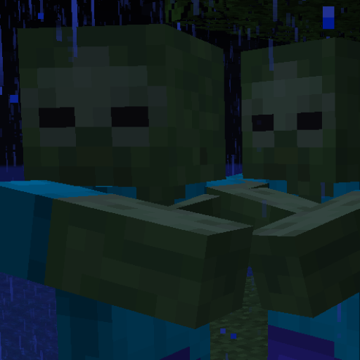

# DoubleZombies
True to the title. DoubleZombies is a simple Minecraft datapack that doubles the number of zombies every 5 minutes.

# WARNING!
Use on servers **at your own risk**. There is currently no way that the pack removes or limits any zombies, so it will keep doubling them as long as your server is on.

Developers: If you have a fix for this, feel free to submit a pull request!

## This is Free and Open Source.
Feel free to modify and redistribute the project as you please--on the one condition that you **need** to **keep the original, unmodified LICENSE.txt file in it!**
Failing to do so breaks the license terms.
